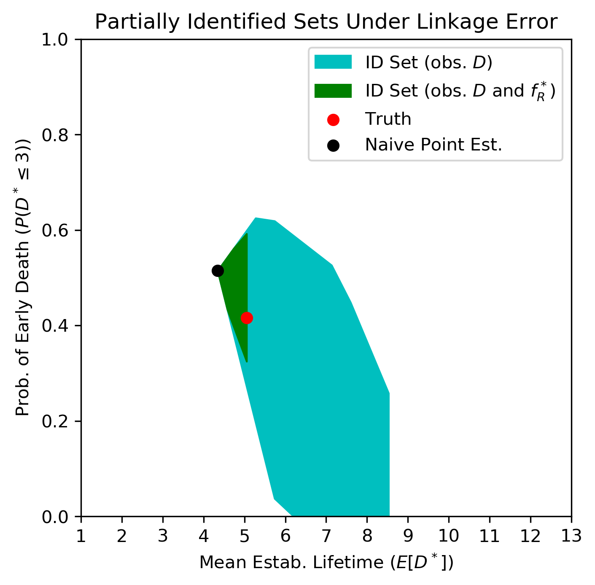
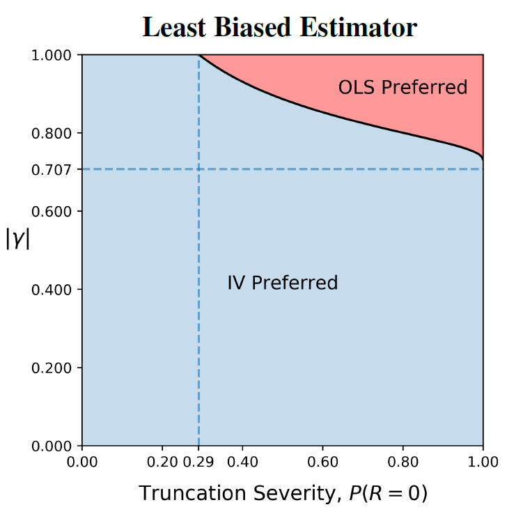

### Recent Papers

"**[Birth, Death, and Record Linkage: Survival Analysis in the Presence of Record Linkage Error](assets/papers/Elan_Segarra_JMP.pdf)**"

Abstract: When record linkage methods are employed during the creation of panels, the observed data may not be representative of reality. 
In this paper I study survival analysis (e.g. firm death, mortality, or emigration) when missed linkages induce error in the observed lifetime durations, and thus inconsistency in standard survival estimators. New methods are developed which restore consistency of the parameters of interest without correcting the linkages. This work makes three distinct theoretical contributions under increasingly relaxed assumptions. First, under the strong assumption of a known independent linkage error process I show that the marginal distribution of time to death is nonparametrically identified from linkage error induced durations. Second, when observations on start and end dates are introduced, I show that nonparametric point identification of the joint distribution of lifetimes and linkage error is typically achieved. Third, when no restriction is placed on the dependence structure, I apply partial identification methods to derive sharp informative bounds on the marginal distribution of lifetimes. New estimators and inference methods are introduced across all scenarios and their validity is established formally. The methods are applied to longitudinal business data (where linkage error occurs due to establishment relocation), and show that establishment death rates in the first 3 years can be overestimated by as much as 10 percentage points with naive methods, while those proposed here are able to recover true rates of survival from mis-linked data.

"**[Instrumental Variables with Treatment-Induced Selection: Exact Bias Results](https://arxiv.org/abs/2005.09583)**" (with Felix Elwert)

Abstract: Instrumental variables (IV) estimation suffers selection bias when the analysis conditions on the treatment. In this paper, we derive exact analytic expressions for IV selection bias across a range of data-generating models, and for various selection-inducing procedures. We present four sets of results for linear models. First, IV selection bias depends on the conditioning procedure (covariate adjustment vs. sample truncation). Second, IV selection bias due to covariate adjustment is the limiting case of IV selection bias due to sample truncation. Third, in certain models, the IV and OLS estimators under selection bound the true causal effect in large samples. Fourth, we characterize situations where IV remains preferred to OLS despite selection on the treatment. These results broaden the notion of IV selection bias beyond sample truncation, replace prior simulation findings with exact analytic formulas, and enable formal sensitivity analyses.

### Working Papers

"Estimating Preferences Over Data to Inform Statistical Disclosure Control Decisions"

"Elasticity Estimation in Discrete Choice Models with Population Misspecification" (with Diwakar Raisingh)

"Efficiency in Measurement Error Models: Applications to Twin Studies and Peer Effects"

"Sanctuaries for Immigrants or Criminals? Investigating the Effects of Sanctuary Policies on Crime"

### Published Papers

"[Employment and payroll dynamics in support services for agriculture](https://onlinelibrary.wiley.com/doi/abs/10.1002/aepp.13271)" (with Anton Babkin, Richard A. Dunn, Brent Hueth)

### Work In Progress

"Workers' Compensation Policy Effects on SOII Reporting" (with Nicole Nestoriak, Benjamin Raymond)

"Generalized Method of Moments Estimation with Linked Data Sets"

"Identification of Market Size in the Estimation of Discrete Choice Models" (with Diwakar Raisingh)

"Sufficient Statistics For Correcting Record Linkage Error"
