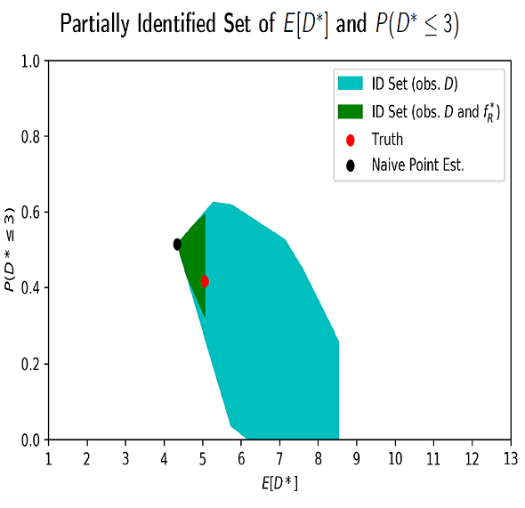
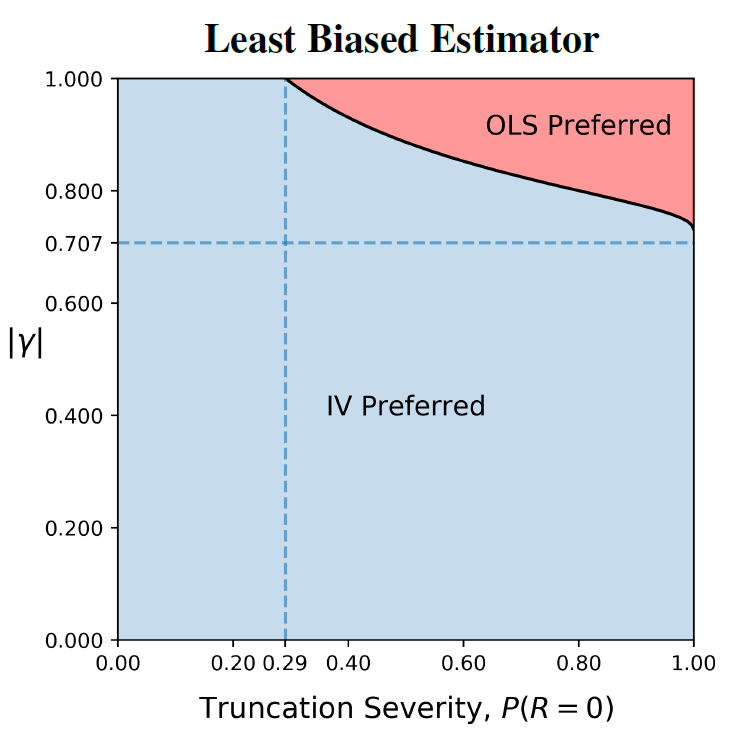

This is where I will talk about my research projects...

**Birth, Death, and Record Linkage: Survival Analysis in the Presence of Record Linkage Error**  
Elan Segarra

   
 
   

   

   When linkage methods employed in the creation of longitudinal panels is subject to error they can be imperfect representations of reality.
   In this paper I study survival estimation (e.g. firm death, mortality, or emigration) when missed linkages induce error in the observed lifetime durations, and thus inconsistency in standard survival estimators.
   Importantly, the error introduced does not take the form of a standard competing risks model, and the methods developed here illustrate that consistency of the parameters of interest can be restored without correcting the linkages.
   This work makes three distinct theoretical contributions: First, under a known independent linkage error process I show that the marginal distribution of time to death is non-parametrically identified from linkage error induced durations, and I provide consistent estimators.
   Second, I provide sharp informative bounds on the marginal distribution of death when independence is relaxed.
   Third, when start and end periods are also observed, I show the marginal distribution of death can be point identified without imposing any dependence structure on the linkage error
   The methods are then applied to longitudinal business data (where linkage error occurs due to firm relocation) to show that traditional estimates of survival rates of new firms are significantly overestimated
   Finally, I discuss additional applications to the estimation of household migration and mortality where linkage error is induced by family name changes at marriage.
   

**Instrumental Variables with Treatment-Induced Selection: Exact Bias Results**  
Felix Elwert and Elan Segarra

   
 
   

   

   Instrumental variables (IV) estimation suffers selection bias when the analysis conditions on the treatment. In this paper, we derive exact analytic expressions for IV selection bias across a range of data-generating models, and for various selection-inducing procedures. We present four sets of results for linear models. First, IV selection bias depends on the conditioning procedure (covariate adjustment vs. sample truncation). Second, IV selection bias due to covariate adjustment is the limiting case of IV selection bias due to sample truncation. Third, in certain models, the IV and OLS estimators under selection bound the true causal effect in large samples. Fourth, we characterize situations where IV remains preferred to OLS despite selection on the treatment. These results broaden the notion of IV selection bias beyond sample truncation, replace prior simulation findings with exact analytic formulas, and enable formal sensitivity analyses.
   

